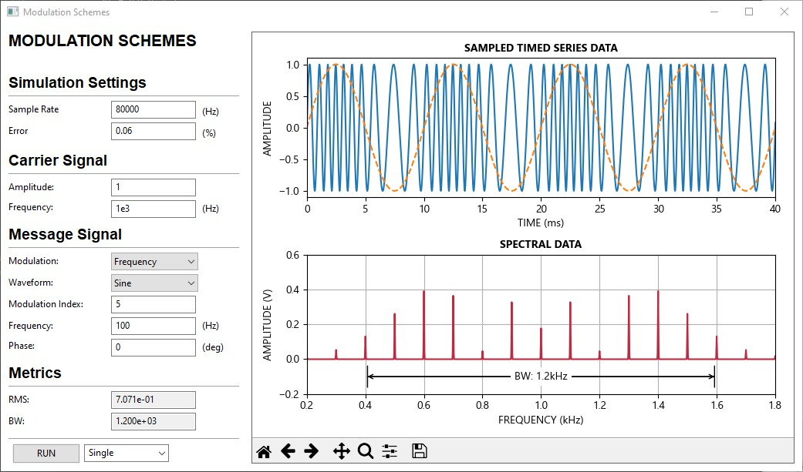

# Modulation Schemes

This application demonstrates various modulation schemes.

## The Signals
%20=%20A_c%20cos%20(2%20\pi%20f_c%20t))

%20=%20A_m%20cos%20(2%20\pi%20f_m%20t%20+%20\varphi_m))

## Amplitude Modulation
%20=%20c(t)%20\times%20m(t))

## Phase Modulation
%20=%20cos%20(2%20\pi%20f_c%20+%20k_p%20m(t)))

## Frequency Modulation

For a given frequency modulated signal, the frequency varies linearly with the modulating message:

%20=%20A_c%20cos%20(%20\varphi_i(t))%20=%20A_c%20cos%20(2%20\pi%20f(t)t+\theta_c))

The instantaneous phase, is expressed as:

%20=%20\omega(t)t}%20=%202%20\pi%20f(t)t%20+%20\theta_c)

Which is derived from the generalized definition for instantaneous frequency, which is the derivative of phase with respect to time:

%20\equiv%20\frac{1}{2%20\pi}%20\frac{d%20\varphi_i(t)}{dt})

%20\equiv%202%20\pi%20\int_0^t{f_i(\tau)%20d\tau})

Thus, when evaluating causal signals with linearly varying frequency, such as:

%20=%20f_c%20+%20k_f%20m(t))

The resultant modulated frequency based on the provided message signal with units of magnitude versus time must be converted to instantaneous phase versus time, which becomes:

=2\pi\int_{0}^{t}{f_i\left(\tau\right)}d\tau=2\pi\left(f_ct+k_f\int_{0}^{t}m\left(\tau\right)d\tau\right))

Which provides the general expression for a frequency modulated signal:

=A_c\cos{\left(\theta_i\right)}=A_c\cos{\left(2\pi\left(f_ct+k_f\int_{0}^{t}m\left(\tau\right)d\tau\right)\right)})

## Integration
### Sine
=A_m\cos{\left(2\pi%20f_mt+\varphi_m\right)})

=\frac{A_m}{\pi%20f_m}\sin{\left(\pi%20f_mt\right)}\cos{\left(\pi%20f_mt+\varphi_m\right)})

=A_m\sin{\left(2\pi%20f_mt+\varphi_m\right)})

=\frac{A_m}{\pi%20f_m}\sin{\left(\pi%20f_mt\right)}\sin{\left(\pi%20f_mt+\varphi_m\right)})

**Note:** scaling to the appropriate time-base is required. If evaluating across N, divide M[n] by the sampling frequency.

### Triangle

![m\left(t\right)=\frac{2}{\pi}\sin^{-1}{\left[\sin{\left(\pi t\right)}\right]}](https://latex.codecogs.com/svg.latex?m\left(t\right)=\frac{2}{\pi}\sin^{-1}{\left[\sin{\left(\pi%20t\right)}\right]})

=\frac{4}{T}\left|\left(\left(x-\frac{T}{4}\right)\%20mod\%20T\right)-\frac{T}{2}\right|-1)

=\left\{\begin{matrix}1&space;&&space;1&space;\\1&space;&&space;1&space;&space;\\\end{matrix}\right.)

=\int_{0}^{t}m\left(\tau\right)d\tau=\int_{0}^{t}\left\{\begin{matrix}\frac{4}{T}\tau-1&\tau%3C\frac{T}{2}\\-\frac{4}{T}\tau+3&\tau\geq\frac{T}{2}\\\end{matrix}\right.d\tau=\left\{\begin{matrix}\left(\frac{2}{T}x^2-x\right)\%20&if\%20x%3C\frac{T}{2}\\\left(-\frac{2}{T}x^2+3x\right)&if\%20x\geq\frac{T}{2}\\\end{matrix}\right.])

**Note:** scaling to the appropriate time-base is required. If evaluating across N, divide M[n] by the sampling frequency.

### Sawtooth

=\frac{t}{T}%20=\frac{x%20\mod%20T}{T})

=\int_{0}^{t}m\left(\tau\right)d\tau=\int_{0}^{t}{\frac{\tau}{T}d\tau}=\boxed{\frac{1}{T}\left(x%20\mod%20T\right)^2-\left(x%20\mod%20T\right)})

**Note:** scaling to the appropriate time-base is required. If evaluating across N, divide M[n] by the sampling frequency.

### Square
=\left\{\begin{matrix}1&if\%20x%3C\frac{T}{2}\\-1&if\%20x\geq\frac{T}{2}\\\end{matrix}\right.)

=\left\{\begin{matrix}x&if\%20x%3C\frac{T}{2}\\-x&if\%20x\geq\frac{T}{2}\\\end{matrix}\right.)

**Note:** scaling to the appropriate time-base is required. If evaluating across N, divide M[n] by the sampling frequency.

### Shift Keying

    import numpy as np

    fs = 100000	# sampling frequency
    fm = 100  	# modulating frequency
    T = fs/fm	# samples per period

    # repeat
    mt = np.repeat(binary_message, T)[:N]

    # or ravel
    mt_ = np.ravel(np.matlib.repmat(binary_message, T, 1), order='F')[:N]

    # or kronecher
    array_ones = np.ones(T)
    mt__ = np.kron(binary_message, array_ones)[:N]

    # integral
    Mt = x * (2 * m(t) - 1)

**Note:** scaling to the appropriate time-base is required. If evaluating across N, divide M[n] by the sampling frequency.

**Example:**
The number of samples contained in the buffer of your measurement window. In other words, the number of samples collected is defined by:

    N = 7
The number of samples contained in one period of the modulating frequency

    T = fs/fm = 2

The message being transmitted

    binary_message = [1, 0, 1, 1]

Message is repeated T number of times

    mt = [1, 1, 0, 0, 1, 1, 1, 1]

Depending on the number of samples available in the measurement buffer, m(t) may become truncated:

    mt = m(t)[:N] = 1, 1, 0, 0, 1, 1, 1]

If modulation scheme is Phase shift-keying (PSK):

    pi = np.pi
    mt = pi * m(t) = [pi, pi, 0, 0, pi, pi, pi]